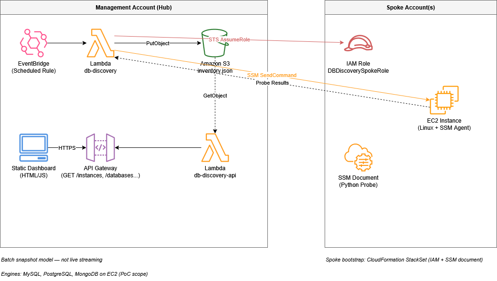

# AWS Database Discovery

**Discover databases (MySQL, PostgreSQL, MongoDB) on EC2 across AWS accounts — no SSH — and expose results via a REST API and optional web UI.**

> **Confidentiality Notice:** This project is confidential and proprietary to AIRBUS. Unauthorized distribution, disclosure, or use is strictly prohibited.

[](https://aws.amazon.com)
[](https://python.org)

**Repository:** [github.com/BSTushar/AWS_Database_Discovery](https://github.com/BSTushar/AWS_Database_Discovery)

---

## Overview

This proof-of-concept runs a **read-only** probe on **SSM-managed Linux** instances (per account/region), collects engine metadata (type, version, sizing hints, tags, instance type), writes a **single S3 snapshot** (`discovery/inventory.json` by default), and serves it through **API Gateway + Lambda**.

### Key Features

| Feature | Description |
|--------|-------------|
| **Cross-account** | Management account assumes **`DBDiscoverySpokeRole`** in spokes (STS). |
| **No SSH** | **SSM Run Command** + custom document runs `discovery_python.py`. |
| **FinOps-friendly store** | One JSON object per run in S3 (not per-row DynamoDB for this POC). |
| **REST API** | Regions, accounts, instances grouped with DBs; **CORS** enabled for browsers. |
| **Optional UI** | `inventory_ui.html` — region/account dashboard; set **`BASE_URL`** to your API stage. |
| **Spoke bootstrap** | CloudFormation **StackSet** template under `automation/` for roles + SSM document. |

---

## Architecture

The design is **hub-and-spoke**: discovery runs in the **management (hub) account**, assumes into **member (spoke) accounts**, drives **SSM** on EC2, then **aggregates** into one **S3** object consumed by a separate **API Lambda**. The UI is a static page that calls the API only (no direct access to databases or spokes).

### Reference diagram (hub and spoke)



### Components by layer

| Layer | Components | Responsibility |
|-------|------------|------------------|
| **1 — Spoke / edge** | EC2 (Linux), SSM Agent, instance profile, `DBDiscoverySpokeRole` (assumable from hub), SSM document `DBDiscovery`, `ssm/discovery_python.py` | Run the probe **on-instance**; detect MySQL / PostgreSQL / MongoDB; report metadata. **No inbound SSH.** |
| **2 — Hub orchestration** | `lambda/discovery_handler.py` (`db-discovery`), IAM for STS + SSM + S3 write | Resolve account list (manual list and/or org), iterate regions, assume spoke role, `SendCommand`, merge/normalize rows, write **one** snapshot to S3. |
| **3 — Durable inventory** | S3 bucket + key (`RESULTS_S3_BUCKET` / `RESULTS_S3_KEY`) | **Point-in-time source of truth** per run; API reads this object (no separate DB for inventory in this POC). |
| **4 — Read API** | `lambda/api_handler.py` (`db-discovery-api`), API Gateway | REST: health, regions, accounts, instances, `/databases` with filters; **CORS** for browser clients. |
| **5 — Presentation** | `inventory_ui.html` | Optional dashboard; configure **`BASE_URL`** to the API stage URL. |
| **6 — Scale / repeatability** | `automation/spoke-bootstrap-stackset.yaml`, EventBridge template in `automation/` | StackSet-style **IaC** for spoke IAM + SSM document; optional **scheduled** discovery. |

**Why snapshot + API:** Scanning the org is **decoupled** from dashboard reads — faster UI, stable numbers for a given refresh, and predictable cost versus live per-click discovery.

Detail and setup order: [FULL_SETUP_IN_ORDER.md](FULL_SETUP_IN_ORDER.md) · StackSet: [automation/STACKSET_AUTOMATION.md](automation/STACKSET_AUTOMATION.md)

---

## Automation coverage (qualitative)

Percentages describe **operational toil removed** when StackSet, org-wide discovery, EventBridge, and sensible bucket policies are in place — **not** “% of code automated.” (See [automation/TIER3_RESEARCH_SHEET.md](automation/TIER3_RESEARCH_SHEET.md) for Tier 1 vs Tier 3 context.)

| Area | Typical automation (with StackSet + schedule) | Notes |
|------|-----------------------------------------------|--------|
| **Spoke IAM + SSM document** | **~80–90%** | StackSet deploys to target OU; drift still needs detection/process. |
| **Per-account S3 bucket policy entries** | **~0–50%** | Manual per account unless **org-scoped** bucket policy (`aws:PrincipalOrgID`, role patterns) or automation. |
| **Account list to scan** | **~50–100%** | Low if only `SPOKE_ACCOUNTS`; high with **`DISCOVER_ALL_ORG_ACCOUNTS=true`** on management. |
| **Run discovery on a cadence** | **~100%** | EventBridge → `db-discovery` Lambda. |
| **EC2 exists with correct SSM profile** | **~0–20%** | StackSet does **not** launch EC2; provisioning is separate (Terraform, AMIs, etc.). |
| **DB / application ownership** | **0%** | Discovery **observes**; it does not install or own databases. |
| **End-to-end: new account → dashboard** | **~40–60%** | Needs StackSet auto-deploy + org discovery + bucket policy + EC2 online in region + `DISCOVERY_REGIONS`. |

**Tier 3 (enterprise)** in the research sheet means **governance add-ons** (org CloudTrail, Config, SCPs, account factory patterns) around the **same** discovery core — not a different detection engine.

---

## Quick Start

1. **Clone**
   ```bash
   git clone https://github.com/BSTushar/AWS_Database_Discovery.git
   cd AWS_Database_Discovery
   ```

2. **Deploy / configure** — Follow [FULL_SETUP_IN_ORDER.md](FULL_SETUP_IN_ORDER.md) (S3, Lambdas, API, IAM, spokes). Spoke bulk install: [automation/STACKSET_AUTOMATION.md](automation/STACKSET_AUTOMATION.md).

3. **Run discovery** (management profile, adjust function/region):
   ```bash
   aws lambda invoke --function-name db-discovery --payload "{}" response.json --cli-binary-format raw-in-base64-out
   type response.json    # Windows
   ```

4. **Call the API** (replace host with your `execute-api` URL and stage):
   ```bash
   curl "https://YOUR_API_ID.execute-api.REGION.amazonaws.com/prod/health"
   curl "https://YOUR_API_ID.execute-api.REGION.amazonaws.com/prod/regions"
   curl "https://YOUR_API_ID.execute-api.REGION.amazonaws.com/prod/accounts?region=ap-south-1"
   curl "https://YOUR_API_ID.execute-api.REGION.amazonaws.com/prod/accounts/123456789012/instances?region=ap-south-1"
   ```

5. **Optional UI** — Open `inventory_ui.html` locally or host statically; set **`BASE_URL`** at the top of the file to the same API **stage URL** (no trailing slash).

---

## Documentation Map

| Document | Purpose |
|----------|---------|
| [FULL_SETUP_IN_ORDER.md](FULL_SETUP_IN_ORDER.md) | Step-by-step setup (console-oriented) |
| [COST_AND_STOP_RESOURCES.md](COST_AND_STOP_RESOURCES.md) | Stop EC2, disable EventBridge, teardown notes |
| [DEMO_RUNBOOK_FRIDAY.md](DEMO_RUNBOOK_FRIDAY.md) | Short presentation script + viva / Q&A pointers |
| [automation/STACKSET_AUTOMATION.md](automation/STACKSET_AUTOMATION.md) | StackSet create/update, OU vs account targets |
| [automation/EVENTBRIDGE_DISCOVERY_SCHEDULE.md](automation/EVENTBRIDGE_DISCOVERY_SCHEDULE.md) | Deploy EventBridge schedule → `db-discovery` (IaC) |
| [automation/OPERATIONS_READINESS_RUNBOOK.md](automation/OPERATIONS_READINESS_RUNBOOK.md) | Monitoring, alarms, and incident response checklist |
| [api/api-gateway-config.md](api/api-gateway-config.md) | Example routes and curl |
| [automation/TIER3_RESEARCH_SHEET.md](automation/TIER3_RESEARCH_SHEET.md) | Tier 3 / automation research notes |

---

## Project Structure

| Path | Description |
|------|-------------|
| `docs/` | Architecture diagram (`architecture.png`) for README / reviews |
| `iam/` | IAM policies (trust, spoke role, Lambda, EC2 instance profile) |
| `ssm/` | `discovery_python.py`, SSM document JSON |
| `lambda/` | `discovery_handler.py`, `api_handler.py`, `lambda_function.py` (zip entry shim) |
| `schema/` | Example inventory record shape |
| `api/` | API Gateway notes |
| `automation/` | StackSet template, `discovery-eventbridge-schedule.yaml`, docs |
| `inventory_ui.html` | Browser dashboard (CORS + `BASE_URL`) |

---

## API Summary

Lambda returns **CORS** headers and handles **OPTIONS** for browser clients.

| Method | Resource | Description |
|--------|----------|-------------|
| GET | `/health` | Status and record count |
| GET | `/` or `/{stage}` | Small service index |
| GET | `/regions` | Regions in the snapshot (after optional query filters) **plus** API Lambda env **`INVENTORY_UI_REGIONS`** / **`DISCOVERY_REGIONS`** |
| GET | `/accounts` | All account IDs in snapshot, or filter with **`?region=`** (used by `inventory_ui.html`) |
| GET | `/regions/{region}/accounts` | Accounts that have rows in that region *(if this path is deployed on API Gateway)* |
| GET | `/accounts/{accountId}` | Flat records; optional **`?region=`** |
| GET | `/accounts/{accountId}/instances` | Instances + `databases[]`; **`?region=`** recommended |
| GET | `/databases` | All rows; optional **`?engine=`**, **`?account_id=`** |

> **Note:** If API Gateway only exposes a subset of paths, prefer **`GET /accounts?region=`** for region-scoped account lists — the Lambda supports it even when nested `/regions/.../accounts` is not wired.

Full detail: [api/api-gateway-config.md](api/api-gateway-config.md)

**API Lambda environment:** Set **`INVENTORY_UI_REGIONS`** or **`DISCOVERY_REGIONS`** (e.g. `eu-west-1,ap-south-1`) on **`db-discovery-api`** so **`GET /regions`** lists every region you scan, not only regions already present in S3.

## Third-party integration (PCP portal / Airbus dashboard)

Use the API as a read-only data source for internal dashboards. Recommended patterns:

- **Direct client-side fetch** (quickest): dashboard frontend calls API Gateway endpoints
  - `GET /regions`
  - `GET /accounts?region=<region>`
  - `GET /accounts/{accountId}/instances?region=<region>`
- **Backend proxy** (preferred for enterprise): PCP/Airbus backend calls this API and exposes normalized JSON to UI clients.

### v2.3 API improvements

`/databases` now supports richer server-side filters so PCP/Airbus portals can request exactly what they need:

- `region=<aws-region>`
- `account_id=<12-digit-account-id>`
- `engine=<mysql|postgres|postgresql|mongodb|none>`
- `instance_id=<ec2-instance-id>`
- `discovery_status=<success|failed|...>`
- `ec2_state=<running|stopped|...>`

### Suggested contract for dashboard consumers

1. Load regions.
2. Load accounts for selected region.
3. Load grouped instances for selected account + region.
4. Apply client filters (engine, status, etc.) or call dedicated backend filtering if needed.

### Security and access recommendations

- Put API Gateway behind the organization identity model:
  - Cognito/JWT authorizer or IAM auth
  - Optional API key + usage plan for partner/internal apps
- Restrict CORS origins to known portal domains in production.
- For cross-org integrations, front the API with an internal service gateway/reverse proxy and enforce RBAC there.
- Add CloudWatch metrics/alarms and access logs for auditability.

### Example (backend-to-backend fetch)

```bash
curl "https://YOUR_API_ID.execute-api.REGION.amazonaws.com/prod/regions"
curl "https://YOUR_API_ID.execute-api.REGION.amazonaws.com/prod/accounts?region=ap-south-1"
curl "https://YOUR_API_ID.execute-api.REGION.amazonaws.com/prod/accounts/123456789012/instances?region=ap-south-1"
```

### Example (`/instances` grouped)

```json
{
  "account_id": "123456789012",
  "instances": [
    {
      "instance_id": "i-0abc123",
      "instance_type": "t3.medium",
      "tags": { "Name": "db-server-01", "Environment": "production" },
      "discovery_status": "success",
      "databases": [
        {
          "db_id": "mysql-3306",
          "engine": "mysql",
          "version": "8.0.35",
          "status": "running",
          "data_size_mb": 2048
        }
      ]
    }
  ]
}
```

---

## Discovery Lambda (high level)

| Env var | Role |
|---------|------|
| `SPOKE_ACCOUNTS` | Optional comma-separated spoke IDs (manual extras / non-org accounts) |
| `DISCOVERY_REGIONS` | Regions to scan per account |
| `DISCOVERY_INCLUDE_STOPPED_EC2` | Default **`true`**: also list non-terminated Linux EC2 via `DescribeInstances` and write **`skipped_offline`** stubs when SSM is not Online. Set **`false`** for SSM-Online-only (legacy). |
| `DISCOVER_ALL_ORG_ACCOUNTS` | If `true`, discover ACTIVE org members automatically each run (management account) |
| `ORG_SKIP_MANAGEMENT_ACCOUNT`, `ORG_EXCLUDE_ACCOUNT_IDS` | Optional filters |
| `RESULTS_S3_BUCKET`, `RESULTS_S3_KEY` | Snapshot location |
| `SPOKE_ROLE_NAME`, `SSM_DOCUMENT` | Assume role name and SSM document name |

After each run, the **API** reads the latest object — no separate database sync.

---

## Prerequisites

- AWS CLI configured for **management** (and console access for spokes as needed)
- Spokes: **`DBDiscoverySpokeRole`** + EC2 instance profile with **SSM**; instances **Online** in Fleet Manager
- **Linux** probe path (Windows instances are not targeted by the current listing filter)

## Quality gates (intern excellence pass)

- Unit tests for API filtering and discovery account-resolution behavior under `lambda/test_*.py`
- GitHub Actions workflow (`.github/workflows/python-tests.yml`) runs tests on every push/PR
- Ops playbook for alarms/triage in `automation/OPERATIONS_READINESS_RUNBOOK.md`

---

## Limitations

- **SSM-managed Linux only** — instances must be **ManagedInstance** / Fleet Manager **Online** for a successful probe; command must finish within **SSM timeout**.
- **Engine scope** — **MySQL, PostgreSQL, MongoDB** on **EC2** as implemented in `discovery_python.py`; custom paths, containers-only DBs, or other engines may be **missed** (false negatives).
- **No RDS / Aurora / DocumentDB / ECS / EKS** inventory in this POC — only **on-EC2** processes/paths the script understands.
- **Snapshot model** — inventory is **point-in-time** per Lambda run; not live streaming. Staleness = time since last successful discovery (+ schedule interval).
- **Hub permissions** — discovery quality depends on **correct spoke roles**, **bucket policies**, and **region lists**; gaps show as skipped accounts or empty partial snapshots.
- **Windows EC2** — not targeted by the current Linux-oriented discovery filter.
- **Production API hardening** — CORS, auth, and logging should be tightened for enterprise exposure (see **Security and access recommendations** above).
- **CMDB accuracy** — reflects **what the probe could observe**, not organizational ownership or approval workflows.

---

## Authors

- **Tushar Bapu Shashikumar** ([@BSTushar](https://github.com/BSTushar)) — [tusharsbapu@gmail.com](mailto:tusharsbapu@gmail.com)  
- Airbus Cloud Intern Project — **Task_02**

---

## License and redistribution

There is **no** open-source `LICENSE` file. Use and redistribution are governed by the **Confidentiality Notice** at the top of this README and AIRBUS / organizational policy.
